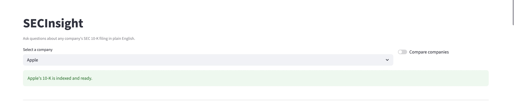
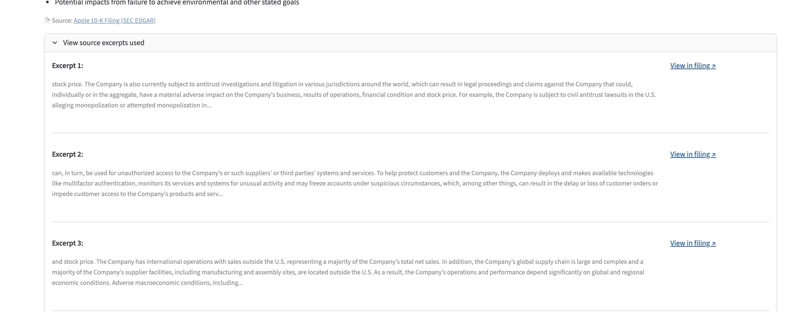
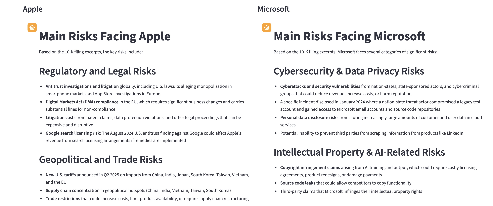
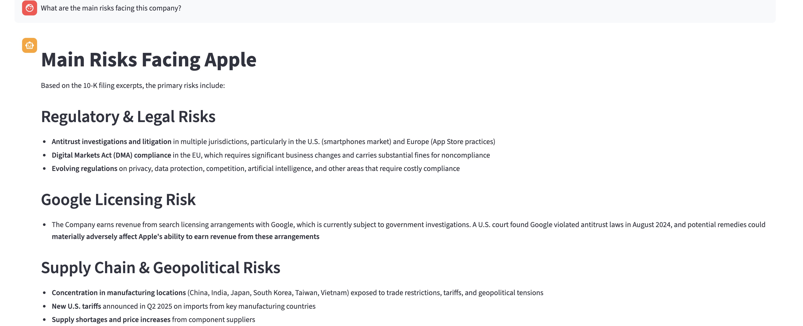

# SECInsight

**Built with:** Anthropic Claude API · ChromaDB · Streamlit · SEC EDGAR · Python

📹 Demo coming soon

---

## Screenshots






---

## What it does

SECInsight lets you ask plain English questions about any company's SEC 10-K annual filing and get accurate, sourced answers powered by Claude. Instead of reading through hundreds of pages of dense regulatory filings, you ask a question and get a direct answer with citations back to the exact excerpts used.

---

## Features

- **RAG pipeline**: retrieves the most relevant chunks from the filing before generating an answer, grounding Claude's response in the actual document
- **Conversational memory**: follow-up questions are answered in context of the conversation history
- **Compare mode**: select multiple companies and get side-by-side answers to the same question
- **Source linking**: every answer includes a link back to the SEC EDGAR filing and expandable excerpts showing exactly what was used
- **Example questions**: one-click prompts to explore common filing topics
- **8 companies pre-loaded**: Apple, Microsoft, Google, Meta, Amazon, Snowflake, Salesforce, Nvidia

---

## Architecture

```
SEC EDGAR API
      |
  sec_fetcher.py       <- fetches latest 10-K, parses iXBRL HTML
      |
  chunker.py           <- splits text into 800-word chunks with 100-word overlap
      |
  vector_store.py      <- embeds chunks and stores in ChromaDB (ONNX embeddings)
      |
  query.py             <- retrieves top 8 relevant chunks, streams answer via Claude API
      |
  app.py               <- Streamlit chat interface with session state
```

Anti-hallucination by design: Claude is instructed via system prompt to answer only from the provided excerpts. If the answer is not in the filing, it says so.

---

## Stack

| Component | Tool |
|---|---|
| LLM | Anthropic Claude (claude-haiku-4-5) |
| Vector DB | ChromaDB with ONNX embeddings |
| Filing source | SEC EDGAR public API |
| HTML parsing | BeautifulSoup |
| UI | Streamlit |
| Language | Python |

---

## Quick Start

```bash
# Install dependencies
pip install -r requirements.txt

# Add your Anthropic API key
echo "ANTHROPIC_API_KEY=your_key_here" > .env

# Run the app
streamlit run app.py
```

Then select a company, click Fetch and Index, and start asking questions.

---

## Data Source

SEC EDGAR public API at data.sec.gov. All 10-K filings are publicly available. No authentication required.

---

## Acknowledgments

Built with assistance from [Claude Code](https://claude.ai/code) by Anthropic.
